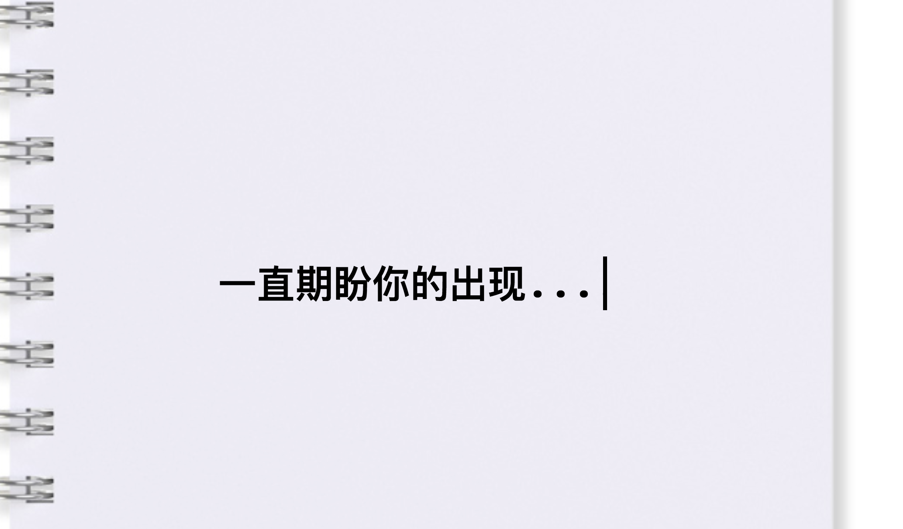
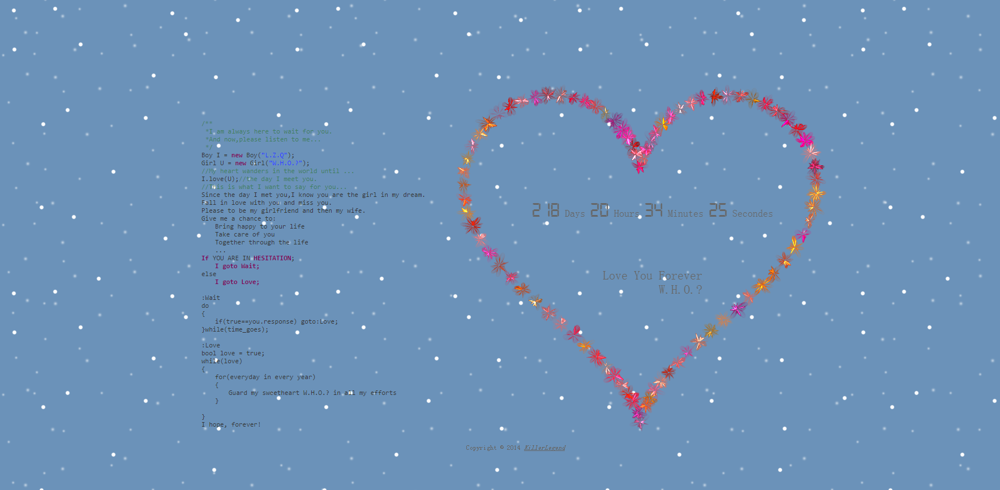
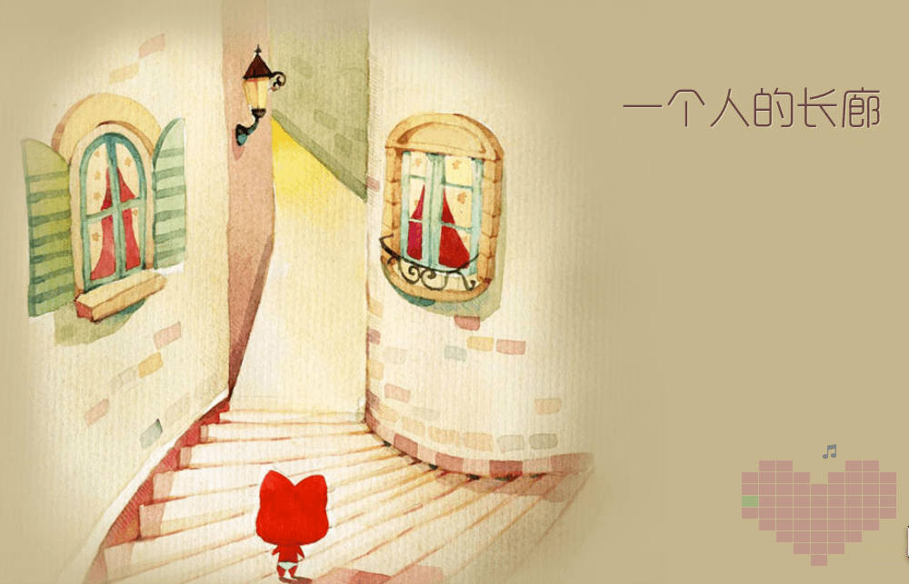

## 网页

适用对象: `不懂技术的妹子`

送礼时机: 任何想表白的日子

------

[网页源码](love.haofly.net)

大概是大二的圣诞节，我做了这么一个网页，想给暗恋已久的她表白。当时还跑到[V2EX](https://www.v2ex.com/t/157281#reply173)上面发帖求点赞，因为我的网页里面还包含了一个点赞按钮，后台能查看实时统计数据，最后大概总共有1000多个UV，成就感还是满满的。网页背景音乐是《夜的钢琴曲五》，不知道为什么，每次在冬天听到这首歌就特别的暖。不过最后的最后我没有把这个给她看。不要觉得遗憾，有些人，错过了就错过了，没什么好遗憾的，都是人生中的一道风景。毕竟，我现在已经有了命中注定的那个她。

—— haoflynet

------

[网页源码](https://github.com/phodal/valentine)

全栈大神phodal做的一个表白神器，网页端只是一个铺垫，重点是他还顺便做了一个漂亮的硬件。用心做的东西，哪个妹子看了不喜欢。

------

[网页源码](https://github.com/Angusme/angusme.github.io)

网上著名的新型表白，背景音乐好听

------

[网页源码](https://github.com/iammapping/wedding)

一个想[在婚礼上搞点事儿](https://www.v2ex.com/t/399784#reply68)的程序员，一个将弹幕与抽奖融合进婚礼请柬的网站，这个创意我给满分。

------

[网页地址](liyang.io/lovestory)

用非常有爱的照片叙述两个人在一起的点点滴滴，右下角的桃心，很一个颗粒代表一张图片，也是很有创意的

------